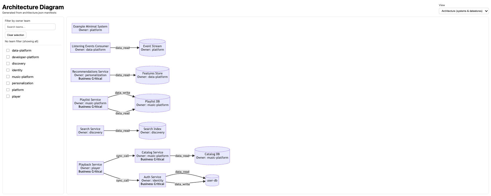
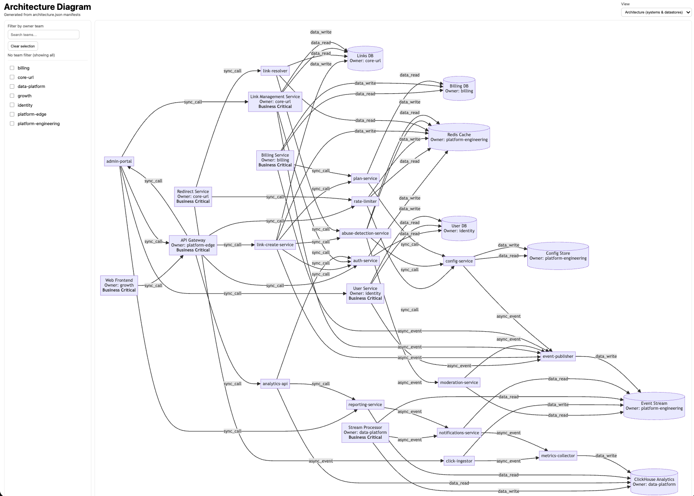

# Architecture Diagrams

This project generates **up-to-date architectural diagrams** from
`architecture.json` manifests stored alongside code in repositories.

The goal is to make system dependencies, ownership, and critical paths
**explicit, versioned, and visible**.

---

## What problem does this solve?

- Architecture diagrams are often outdated
- Dependencies are implicit and hard to reason about
- Ownership and SLA impact are scattered across tools

This project treats architecture as **data**, not documentation.

---

## How it works

1. Each repository contains an `architecture.json` (or *.architecture.json) file
2. The file is validated against a shared JSON Schema
3. All manifests are ingested and normalized into a graph
4. A Mermaid diagram is generated
5. The result is exported as a static web page

---

## Example output

<div style="display:flex; flex-direction:column; gap:16px;">
  
  
</div>

---

## Requirements

- Node.js 20+ (ESM + modern `fs` APIs)
- Yarn 4 (see `packageManager` in `package.json`)

If you don't have Yarn 4 installed, enable Corepack:

```
corepack enable
```

---

## Setup

```
yarn install
```

---

## Run locally

Generate diagrams from a directory containing manifests:

```
yarn dev -- --input <path-to-repo> --output dist/output
```

Build + run the compiled CLI:

```
yarn build
yarn architecture-diagrams --input <path-to-repo> --output dist/output
```

---

## Output artifacts

The output directory contains:

- `index.html` – interactive diagram viewer (open in a browser)
- `app.css` – stylesheet used by the viewer
- `architecture.mmd` – Mermaid source for the architecture view
- `technical.mmd` – Mermaid source for the technical view

Usage tips:

- Open `index.html` directly in a browser, or serve the folder from a static server.
- Commit `*.mmd` files if you want to review diffs in PRs.

---

## Examples

Reset examples and generate sample manifests:

```
yarn dev -- examples reset
yarn dev -- examples basic
yarn dev -- examples url-shortener
```

Then generate diagrams from the examples:

```
yarn dev -- --input examples --output dist/output
```
